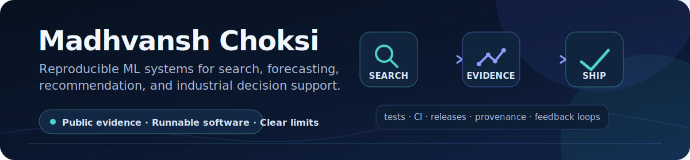

  

# Hi, I'm Madhvansh Choksi

I build open-source machine-learning systems for search, recommendation,
forecasting, and industrial optimization.

My goal is simple: publish projects that a stranger can understand, reproduce,
test, and improve.

**[Try Neural E-Commerce Search in the browser](https://madhvansh.github.io/Neural-E-Commerce-Search/lab.html)**
· [Remix it with your own catalogue](https://github.com/Madhvansh/Neural-E-Commerce-Search/blob/main/docs/FORK_THE_LAB.md)

## Flagship projects

- [Neural E-Commerce Search](https://github.com/Madhvansh/Neural-E-Commerce-Search) — a no-login MiniLM product-retrieval lab, reusable TREC-style evaluation preflight for CI, and tested Python FAISS + DeBERTa reference for Amazon ESCI. The project exposes model identity, scores, and evidence boundaries. MIT licensed.
- [cooling-tower-chem](https://github.com/Madhvansh/cooling-tower-chem) — a small, dependency-free Python library for industrial water-treatment chemistry: the Langelier, Ryznar, Puckorius, Larson-Skold, and Stiff-Davis indices plus CCPP (calcium carbonate precipitation potential), plus cooling-tower water balance (evaporation, blowdown, makeup, cycles of concentration). Fully type-hinted, 111 tests covering formula correctness, reference values, input validation, and monotonicity, CI on Python 3.9–3.13, with a `ctchem` CLI. MIT licensed.
- [TGF](https://github.com/Madhvansh/TGF) — an Apache-2.0 toolkit for cooling-tower forecasting, water-chemistry risk estimation, and model-predictive dosing control. In operational use since 2025 as an advisory system at eight cooling towers across two Indian plants (DCM Shriram Alkali and Atul Ltd, named with permission; maintainer-attested), now self-hosted on-site at DCM Shriram Alkali (four towers) since June 2026 — deployment-confirmation letters in the TGF repo; autonomous closed-loop dosing remains on the roadmap.

## Supporting research and engineering

- [Retail Sales Forecasting Engine](https://github.com/Madhvansh/Retail-Sales-Forecasting-Engine) — a reproducible forecasting benchmark and pipeline built around the M5 dataset. MIT licensed.
- [The Recommender](https://github.com/Madhvansh/The-Recommender) — an experimental, from-scratch comparison of structured state-space sequence models and SASRec-style recommendation. MIT licensed.
- [Social Media Event Organizer](https://github.com/Madhvansh/Social-Media-Event-Organizer) — a collaborative Java Swing project for events, friendships, invitations, RSVPs, notifications, persistence, and reporting. The repository includes 71 passing JUnit tests, architecture documentation, explicit team attribution, and a downloadable desktop release path.
- [SAiDL Spring Assignment 2025](https://github.com/Madhvansh/SAiDL-Spring-Assignment-2025) — a Spring 2025 assignment covering state-space models and CoreML. This is coursework, not a claim of membership, selection, endorsement, or independently reviewed research.

## What I care about

- Reproducible experiments: configs, seeds, raw results, and clear evaluation protocols.
- Honest boundaries between prototypes, simulations, and deployed systems.
- Useful documentation, automated tests, and contributor-friendly issues.
- ML systems that connect research ideas to practical software.

## Current priorities

- Collecting independent validator integrations, browser tests, and catalogue remixes for Neural E-Commerce Search while preparing complete benchmark artifacts.
- Documenting TGF's data provenance, simulation assumptions, and hardware roadmap.
- Making the Retail Forecasting and Recommender experiments independently reproducible.
- Maintaining cooling-tower-chem and contributing upstream to the libraries my projects depend on.
- Turning roadmap items into well-scoped contributor issues.

If you reproduce a result, find a failure case, or want to contribute, please open
an issue in the relevant repository. Specific technical feedback is always welcome.
